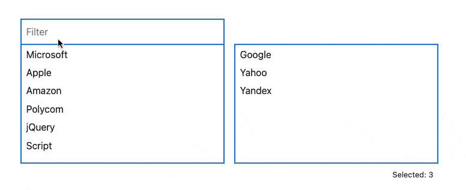

SideBySideMultiSelect
=====================

Is a **javascript** multiselectbox with filters for `select` html tag

## Live Demo

You can check the live demo [right here](https://scheibome.github.io/side-by-side-multiselect/)



## Usage:

**On npm**: `side-by-side-multiselect`

## Style setup in css

~~~css
:root {
    --sideBySiteMultiSelectColor: red;
    --sideBySiteMultiSelectHeight: 200px;
    --sideBySiteMultiSelectSearchFocusColor: yellow;
    --sideBySiteMultiSelectButtonBackgroundColor: blue;
    --sideBySiteMultiSelectButtonBorder: 2px solid pink;
    --sideBySiteMultiSelectSearchFocusBgColor: green;
    --sideBySiteMultiSelectBorderWidth: 2px;
    --sideBySiteMultiSelectOrderSize: 30px;
    --sideBySiteMultiSelectButtonColor: yellow;
}
~~~

## SideBySideMultiSelect

~~~html
<select class="js-sidebysidemultiselect" id="demo1" multiple="multiple" name="tools[]">
    <option value="C++">C++</option>
    <option value="JavaScript">JavaScript</option>
    <option value="PHP">PHP</option>
    <option value="Python">Python</option>
    <option value="Ruby">Ruby</option>
</select>

<script src="side-by-side-multiselect.umd.min.js"></script>
<script type="text/javascript">
    SideBySideMultiselect();
</script>
~~~


## Simple SideBySideMultiSelect without filter

~~~html
<select class="js-sidebysidemultiselect" id="demo2" multiple="multiple" name="tools[]">
    <option value="google" selected="selected">Google</option>
    <option value="microsoft">Microsoft</option>
    <option value="apple">Apple</option>
    <option value="amazon">Amazon</option>
    <option value="yahoo" selected="selected">Yahoo</option>
    <option value="yandex" selected="selected">Yandex</option>
    <option value="polycom">Polycom</option>
    <option value="jquery">jQuery</option>
    <option value="script">Script</option>
</select>

<script src="side-by-side-multiselect.umd.min.js"></script>
<script type="text/javascript">
    SideBySideMultiselect({
        'selector': '.myselectfield',
        'hidefilter': true
    });
</script>
~~~

## SideBySideMultiSelect Options

Example use of the options.

~~~javascript
SideBySideMultiselect({
    'selector': '.js-sidebysidemultiselect',
    'hidefilter': true,
    'hideCounter': false,
    'showfilterplaceholder': true,
    'hidefilterlabel': true,
    labels: {
        'filter': 'Filter',
        'selected': 'Selected'
    },
    classSettings: {
        'labelclass': 'your-labelclass',
        'wrapperclass': 'your-wrapperclass',
        'optionclass': 'your-optionclass',
        'boxesclass': 'your-boxesrclass',
        'searchclass': 'your-searchclass',
        'counterclass': 'your-counterclass',
        'orderclass': 'your-orderboxclass'
    },
    buttons: {
        'arrow': 'innerHTML for toTop and ToBottom',
        'singlearrow': 'innerHTML for up and down',
        'trashicon': 'innerHTML for remove',
    }
});
~~~

| Option | Type | Default | Description |
| --- | --- | --- | --- |
| selector | string | `.js-sidebysidemultiselect` | Name of the selector for example '.js-sidebysidemultiselect' |
| hideFilter | boolean | `false` | Hide the filter |
| hidefilterlabel | boolean | `false` | add a label to filter input  |
| showfilterplaceholder | boolean | `false` | Add a placeholder to the filter input  |
| classSettings | object | `See options example` | Name of the skin, it will add a class to the lightbox so you can style it with css. |
| hideCounter | boolean | `false` | Hide the counter |
| orderOption | boolean | `false` | display the manual order elements |
| buttons | object | `See options example` | HTML for the Buttons |
| labels | object | `See options example` | The label content  |

## Including SideBySideMultiSelect

SideBySideMultiSelect is distributed as an ES6 module, but there is also a UMD module included.
How to install

```npm i side-by-side-multiselect```

### Example with vanilla js
This is what I used in the demo. Checkout index.html and demo.js.

```js
import SideBySideMultiselect from './side-by-side-multiselect.js';

window.onload = function() {
    SideBySideMultiselect({
        'selector': '.js-sidebysidemultiselectdemo2',
        'hidefilter': true,
        'hideCounter': true,
    });
}
```

Include in your html. Notice the `type` attribute:
```html
<script src="./demo.js" type="module"></script>
```

To support IE and legacy browsers, use the `nomodule` script tag to include separate scripts that don't use the module syntax:

```html
<script nomodule src="js/side-by-side-multiselect.umd.js"></script>
```

Author
------

[Thomas Scheibitz][scheibome]

License
-------

[MIT](https://opensource.org/licenses/MIT)
[scheibome]: https://github.com/scheibome/
